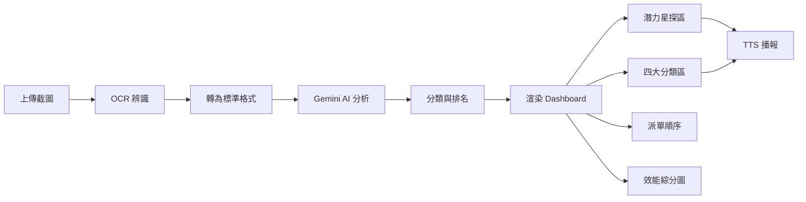

# 行銷火力分析系統 - 完整架構文件

## 系統概述

**專案名稱**: 行銷火力分析系統 (Marketing Firepower Analysis)
**技術棧**: React + TypeScript + Vite + Tailwind CSS + Gemini AI
**主要功能**: 員工績效分析、AI 智能分類、TTS 語音播報、潛力星探測

## 檔案結構

```
Firepower_Analysis/
├── components/
│   ├── Dashboard.tsx          # 主儀表板（包含潛力星探區、四大分類區）
│   ├── ChatBot.tsx            # AI 聊天機器人
│   ├── ApiDiagnostics.tsx     # API 診斷工具
│   ├── FileUpload.tsx         # 檔案上傳組件
│   └── HistoryView.tsx        # 歷史記錄檢視
├── services/
│   ├── geminiService.ts       # Gemini AI 分析與 OCR
│   ├── ttsService.ts          # TTS 語音播報服務
│   └── storageService.ts      # LocalStorage 管理
├── types.ts                   # TypeScript 類型定義
├── App.tsx                    # 主應用程式
├── .env.local                 # 環境變數（API Key）
└── Agent_Skills/              # 技能文件庫
    ├── tts_feature.md
    ├── potential_star_detection.md
    ├── gemini_api_integration.md
    └── SKILL.md (本檔案)
```

## 核心功能模組

### 1. AI 績效分析 (`geminiService.ts`)

**模型**: `gemini-3-flash-preview`

**功能**:
- 分析員工績效數據
- 自動分類為五大組別
- 生成 AI 建議與派單決策

**分類邏輯**:
1. **大單火力組** 🔥：成交率高、客單價高、績效領先
2. **穩定人選** 💎：數據中庸但穩定
3. **待加強** ⚠️：成交率低或數據不穩
4. **風險警告** 🛑：嚴重偏離績效常態
5. **潛力成長組** 🔭：高轉換、低派單（被低估）

### 2. 潛力星探區 (`Dashboard.tsx`)

**目的**: 識別被低估的將才

**判定條件**:
- 成交率 ≥ 團隊平均 + 5%
- 派單數 ≤ 中位數 × 60%

**UI 特色**:
- 深色主題（Professional Deep Night）
- AI 建議順序標籤
- 效能綜分指標（客單價、成交率 vs 團隊平均）
- 點擊可觸發 TTS 播報

### 3. TTS 語音播報 (`ttsService.ts`)

**模型**: `gemini-2.5-flash-preview-tts`
**音色**: `Aoede`（中文女聲）

**播報內容**:
```
${emp.name}，今日關鍵指標為：
派單數 ${emp.todayLeads} 單，成交率 ${emp.todayConvRate}，客單價 ${emp.avgOrderValue.toLocaleString()} 元。
目前歸類為「${emp.category}」，業績排名第 ${emp.revenueRank} 名。
AI 建議：${emp.aiAdvice}
```

**視覺反饋**:
- 藍色呼吸燈 (`ring-4 ring-blue-400`)
- 音波圖示 🔊 + `animate-bounce`

### 4. OCR 圖片辨識 (`geminiService.ts`)

**模型**: `gemini-3-flash-preview`

**功能**:
- 解析行銷報表截圖
- 自動識別表頭與數據
- 轉換為標準 11 欄位格式

**標準欄位**:
1. 行銷(姓名)
2. 派單數
3. 派成數
4. 追續數
5. 總業績
6. 客單價
7. 追續總額
8. 業績排名
9. 追續排名
10. 均價排名
11. 派單成交率

### 5. 當前最優派單順序 (`Dashboard.tsx`)

**排序邏輯**:
```typescript
const dispatchOrder = [...employees].sort((a, b) => {
  const categoryPriority = {
    [EmployeeCategory.FIREPOWER]: 1,
    [EmployeeCategory.STEADY]: 2,
    [EmployeeCategory.NEEDS_IMPROVEMENT]: 3,
    [EmployeeCategory.RISK]: 4,
  };
  
  const aPriority = categoryPriority[a.category] || 99;
  const bPriority = categoryPriority[b.category] || 99;
  
  if (aPriority !== bPriority) return aPriority - bPriority;
  return (a.categoryRank || 99) - (b.categoryRank || 99);
});
```

**UI 特色**:
- 卡片式設計
- 顯示 AI 建議與關鍵指標
- 點擊可滾動到詳細卡片並觸發 TTS

### 6. 人員效能綜分圖 (`Dashboard.tsx`)

**圖表類型**: ComposedChart (Bar + Line)

**資料軸**:
- **左軸（Bar）**: 客單價
- **右軸（Line）**: 成交率 %

**團隊平均指標**:
- 平均客單價
- 平均成交率

## 資料流程



## 環境設定

### 必要環境變數

```env
# .env.local
VITE_GEMINI_API_KEY=你的真實金鑰
```

### 安裝依賴

```bash
npm install
```

### 啟動開發伺服器

```bash
npm run dev
```

### 建置生產版本

```bash
npm run build
```

## 資料格式

### EmployeeData 結構

```typescript
interface EmployeeData {
  id: string;
  name: string;
  
  // 核心指標
  todayLeads: number;          // 派單數
  todaySales: number;          // 派成數
  todayFollowupSales: number;  // 追續總額
  todayNetRevenue: number;     // 總業績
  avgOrderValue: number;       // 客單價
  followupCount: number;       // 追續數
  revenueRank: string;         // 業績排名
  followupRank: string;        // 追續排名
  avgPriceRank: string;        // 均價排名
  todayConvRate: string;       // 派單成交率
  
  // AI 決策
  category?: EmployeeCategory;
  categoryRank?: number;
  aiAdvice?: string;
  scoutAdvice?: string;
  timestamp: number;
}
```

### EmployeeCategory 枚舉

```typescript
enum EmployeeCategory {
  FIREPOWER = '大單火力組',
  STEADY = '穩定人選',
  NEEDS_IMPROVEMENT = '待加強',
  RISK = '風險警告',
  POTENTIAL = '潛力成長組'
}
```

## 常用操作

### 1. 上傳分析

1. 點擊「上傳截圖」按鈕
2. 選擇行銷報表圖片
3. 系統自動 OCR 辨識
4. AI 分析並分類
5. 渲染結果至 Dashboard

### 2. 查看潛力星

1. 捲動至「潛力星探區」（深色區域）
2. 檢視高轉換、低派單的員工
3. 點擊卡片聆聽 TTS 播報
4. 根據「AI 建議順序」調整派單

### 3. 播放語音

1. 點擊任一員工卡片
2. 卡片出現藍色外框 + 音波圖示
3. 聆聽 AI 彙報績效
4. 播放完成後自動消失

### 4. 查看歷史記錄

1. 點擊「歷史記錄」分頁
2. 檢視過往分析結果
3. 點擊「載入」恢復至 Dashboard

## 效能優化

### 1. LocalStorage 管理
- 自動儲存分析結果
- 最多保留 10 筆記錄
- 超過自動刪除最舊記錄

### 2. 圖表渲染
- 使用 Recharts 優化渲染
- 響應式設計（RWD）
- 最小高度 400px

### 3. API 呼叫
- 防抖機制（TTS）
- 錯誤重試（未實作）
- 快取機制（未實作）

## 除錯工具

### 1. API 診斷
位置：`components/ApiDiagnostics.tsx`

功能：
- 檢查 API Key 狀態
- 測試模型可用性
- 查看配額使用情況

### 2. 瀏覽器 Console
```typescript
console.log('TTS Response:', response);
console.log('AI Analysis:', analyzedResults);
console.log('Potential Stars:', potentialStars);
```

## 已知問題與解決方案

### 1. 圖表寬度警告
**問題**: `The width(-1) and height(-1) of chart should be greater than 0`

**原因**: 容器尺寸未初始化

**解決**: 圖表已設定 `h-[400px]`，警告可忽略

### 2. Tailwind CDN 警告
**問題**: `cdn.tailwindcss.com should not be used in production`

**原因**: 使用 CDN 版本（開發用）

**解決**: 生產環境改用 PostCSS 版本

### 3. TTS 模型 404
**問題**: `gemini-2.0-flash-exp is not found`

**原因**: 模型名稱錯誤

**解決**: 已更新為 `gemini-2.5-flash-preview-tts`

## 未來規劃

### 短期（1 個月內）
- [ ] 實作 API 快取機制
- [ ] 加入請求重試邏輯
- [ ] 優化圖表載入速度
- [ ] 新增匯出 PDF 功能

### 中期（3 個月內）
- [ ] 多語言支援（英文、簡中）
- [ ] 歷史趨勢分析
- [ ] 自動提醒功能
- [ ] 批次操作（一鍵調整派單）

### 長期（6 個月以上）
- [ ] 後端 API 整合
- [ ] 即時數據同步
- [ ] 權限管理系統
- [ ] 行動 App 版本

## 技能文件維護

### 新增技能文件
1. 在 `Agent_Skills/` 目錄建立 `<feature_name>.md`
2. 使用 YAML frontmatter 定義 name 和 description
3. 撰寫詳細操作手冊

### 更新技能文件
1. 當功能變更時同步更新對應文件
2. 記錄版本更新與變更日誌
3. 保持範例程式碼與實際程式碼一致

### 技能文件索引
- `tts_feature.md`: TTS 語音播報
- `potential_star_detection.md`: 潛力星探區
- `gemini_api_integration.md`: Gemini API 整合
- `SKILL.md`: 系統總覽（本檔案）

## 聯絡與支援

- **專案 GitHub**: [連結待補充]
- **問題回報**: [連結待補充]
- **文件更新**: 2026-02-04
