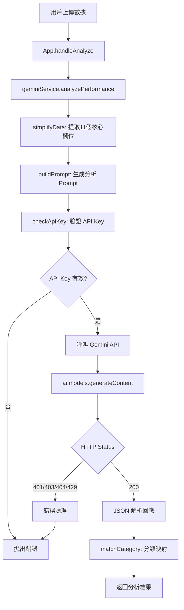

# Gemini API 整合指南 - Agent 技能手冊

## 模型配置總覽

### 當前使用模型（2026-02-04 最新版）

| 功能 | 模型名稱 | 檔案 | 行數 | 用途 |
|------|---------|------|------|------|
| AI 績效分析 | `gemini-3-flash-preview` | `geminiService.ts` | 84 | 員工分類與建議 |
| OCR 圖片辨識 | `gemini-3-flash-preview` | `geminiService.ts` | 161 | 報表截圖解析 |
| TTS 語音播報 | `gemini-2.5-flash-preview-tts` | `ttsService.ts` | 93 | 績效語音合成 |

### 已棄用模型（勿使用）❌

```typescript
// ❌ 錯誤：這些模型已不可用或不支援所需功能
'gemini-3-pro-preview'      // 已被 flash 版本取代
'gemini-2.0-flash-exp'      // 不支援 TTS → 404 Not Found
'gemini-2.5-flash'          // 無 TTS 功能
```

## 呼叫鏈 (Call Graph)

### AI 分析流程


### OCR 流程
```mermaid
graph TD
    A[用戶上傳截圖] --> B[FileUpload.handleFile]
    B --> C[readAsDataURL: base64 編碼]
    C --> D[geminiService.extractDataFromImage]
    D --> E[checkApiKey]
    E --> F{API Key 有效?}
    F -->|否| G[拋出錯誤]
    F -->|是| H[buildOCR Prompt]
    H --> I[呼叫 Gemini API with inlineData]
    I --> J[JSON 解析: string[][]]
    J --> K[轉換為 EmployeeData[]]
    K --> L[返回數據]
```

**關鍵入口點**：
- **API Key 讀取**: `geminiService.ts` 第 7-9 行
- **API Key 驗證**: `geminiService.ts` 第 12-28 行
- **AI 分析**: `geminiService.ts` 第 31-138 行
- **OCR 辨識**: `geminiService.ts` 第 140-183 行

## Quick Runbook - API 故障排查

### 問題 1: 401 Unauthorized
**症狀**: `🔑 API Key 無效`

**檢查清單**:
```bash
# Step 1: 確認 .env.local 存在且格式正確
cat .env.local
# 應顯示: VITE_GEMINI_API_KEY=AIza...

# Step 2: 驗證 API Key 是否有效
curl "https://generativelanguage.googleapis.com/v1beta/models/gemini-3-flash-preview:generateContent?key=你的KEY" \
  -H 'Content-Type: application/json' \
  -d '{"contents":[{"parts":[{"text":"Hello"}]}]}'

# Step 3: 重啟開發伺服器
Ctrl + C
npm run dev
```

**常見原因**:
- API Key 複製不完整
- 金鑰已過期或被撤銷
- 環境變數未正確載入

---

### 問題 2: 403 Forbidden
**症狀**: `🔒 模型權限不足`

**解決方案**:
1. 前往 [Google AI Studio](https://aistudio.google.com/)
2. 檢查專案是否啟用目標模型
3. 若無權限，建立新專案或申請存取

---

### 問題 3: 404 Not Found
**症狀**: `models/gemini-xxx is not found for API version v1beta`

**檢查模型名稱**:
```typescript
// ✅ 正確
model: 'gemini-3-flash-preview'
model: 'gemini-2.5-flash-preview-tts'

// ❌ 錯誤
model: 'gemini-2.0-flash-exp'  // 此模型不存在
model: 'gemini-3-pro-preview'  // 已棄用
```

**修復位置**:
- AI 分析: `geminiService.ts` 第 84 行
- OCR: `geminiService.ts` 第 161 行
- TTS: `ttsService.ts` 第 93 行

---

### 問題 4: 429 Too Many Requests
**症狀**: `⏱️ API 配額已達上限`

**免費配額限制**（參考）:
- RPM (每分鐘請求數): ~15
- RPD (每天請求數): ~1,500
- TPM (每分鐘 Tokens): 32,000

**解決方案**:
```javascript
// 方案 1: 等待 30-60 秒後重試

// 方案 2: 實作指數退避
async function retryWithBackoff(fn, retries = 3) {
  for (let i = 0; i < retries; i++) {
    try {
      return await fn();
    } catch (error) {
      if (error.status === 429 && i < retries - 1) {
        await new Promise(r => setTimeout(r, Math.pow(2, i) * 1000));
      } else {
        throw error;
      }
    }
  }
}

// 方案 3: 升級至付費方案
// https://ai.google.dev/pricing
```

## API 呼叫方式詳解

### 1. AI 績效分析

**完整呼叫範例**:
```typescript
const response = await ai.models.generateContent({
  model: 'gemini-3-flash-preview',
  contents: prompt,
  config: {
    responseMimeType: "application/json",
    responseSchema: {
      type: Type.ARRAY,
      items: {
        type: Type.OBJECT,
        properties: {
          id: { type: Type.STRING },
          category: { type: Type.STRING },
          categoryRank: { type: Type.INTEGER },
          aiAdvice: { type: Type.STRING },
          scoutAdvice: { type: Type.STRING }
        },
        required: ["id", "category", "categoryRank", "aiAdvice"]
      }
    }
  }
});

const result = JSON.parse(response.text);
```

**Prompt 設計關鍵**:
- 清晰定義角色：「資深行銷營運與派單數據科學家」
- 明確目標：「公司整體營收最大化」
- 結構化輸出：使用 `responseSchema` 確保格式

---

### 2. OCR 圖片辨識

**完整呼叫範例**:
```typescript
const response = await ai.models.generateContent({
  model: 'gemini-3-flash-preview',
  contents: {
    parts: [
      { 
        inlineData: { 
          data: base64Image.split(',')[1],  // 移除 data:image/jpeg;base64, 前綴
          mimeType: 'image/jpeg' 
        } 
      },
      { text: prompt }
    ]
  },
  config: {
    responseMimeType: "application/json",
    responseSchema: {
      type: Type.ARRAY,
      items: {
        type: Type.ARRAY,
        items: { type: Type.STRING }
      }
    }
  }
});

const data = JSON.parse(response.text); // string[][]
```

**支援格式**:
- JPEG, PNG, WebP, GIF
- 最大尺寸: 20MB
- 建議解析度: 1024x768 以上

---

### 3. TTS 語音合成

**完整呼叫範例**:
```typescript
const response = await ai.models.generateContent({
  model: 'gemini-2.5-flash-preview-tts',
  contents: script,
  config: {
    responseModalities: ['AUDIO'],  // ⚠️ 必須設定
    speechConfig: {
      voiceConfig: {
        prebuiltVoiceConfig: {
          voiceName: 'Aoede'  // 中文女聲
        }
      }
    }
  }
});

// 從回應中提取音訊
const parts = response.candidates[0].content.parts;
const audioPart = parts.find(part => part.inlineData);
const audioData = audioPart.inlineData.data; // base64 PCM
```

**可用音色**:
- **Aoede**: 中文女聲（專業、清晰）
- **Charon**: 中文男聲（穩重）
- **Puck**: 中文女聲（活潑）

## 錯誤處理策略

### 統一錯誤處理範本

```typescript
try {
  const response = await ai.models.generateContent({...});
  return processResponse(response);
} catch (error: any) {
  // 1. 429 配額錯誤
  if (error?.message?.includes('429') || error?.status === 429) {
    throw new Error('⏱️ API 配額已達上限\n\n點擊太頻繁，請稍候 30 秒後再試。');
  }
  // 2. 403 權限錯誤
  else if (error?.message?.includes('403') || error?.status === 403) {
    throw new Error('🔒 模型權限不足\n\n您的 API Key 所屬專案尚未獲得使用權限。');
  }
  // 3. 401 認證錯誤
  else if (error?.message?.includes('401') || error?.status === 401) {
    throw new Error('🔑 API Key 無效\n\n請檢查 .env.local 檔案。');
  }
  // 4. 404 模型不存在
  else if (error?.message?.includes('404') || error?.status === 404) {
    throw new Error('🤖 模型不可用\n\n請檢查模型名稱是否正確。');
  }
  // 5. 網路錯誤
  else if (error?.message?.includes('network') || error?.message?.includes('fetch')) {
    throw new Error('📡 網路連線失敗\n\n請檢查網路設定。');
  }
  // 6. 一般錯誤
  else {
    throw new Error(`❌ ${error?.message || '未知錯誤'}`);
  }
}
```

## 版本更新紀錄

### 2026-02-04 (當前版本)
- ✅ AI 分析模型: `gemini-3-pro-preview` → `gemini-3-flash-preview`
- ✅ TTS 模型: `gemini-2.0-flash-exp` → `gemini-2.5-flash-preview-tts`
- ✅ TTS 音色: `Charon` → `Aoede`

### 2026-02-03
- ❌ 移除 `gemini-2.0-flash-exp`（404 Not Found）

## 參考資源

- [Gemini API 官方文件](https://ai.google.dev/gemini-api/docs/)
- [Google AI Studio](https://aistudio.google.com/)
- [取得 API Key](https://aistudio.google.com/apikey)
- [模型清單](https://ai.google.dev/gemini-api/docs/models)
- [定價資訊](https://ai.google.dev/pricing)
