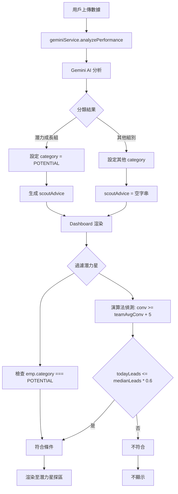

# 潛力星探區 - Agent 技能手冊

## 功能概述

自動識別「被低估的將才」：成交率高、派單數低，值得增加資源投入的員工。

## 呼叫鏈 (Call Graph)



**關鍵入口點**：
- **AI 分類**：`geminiService.ts` 第 50-76 行（Prompt 設計）
- **過濾邏輯**：`Dashboard.tsx` 第 336-344 行
- **UI 渲染**：`Dashboard.tsx` 第 346-451 行
- **效能綜分計算**：`Dashboard.tsx` 第 347-350 行

## Quick Runbook - 快速診斷流程

### 問題 1: 潛力星探區為空
**症狀**：顯示「目前暫無符合『被低估』條件的人才」

**檢查步驟**：
```javascript
// 在 Console 執行
const conv = parseFloat(emp.todayConvRate.replace('%', ''));
const teamAvgConv = employees.reduce((acc, e) => acc + parseFloat(e.todayConvRate.replace('%', '')), 0) / employees.length;
const sortedLeads = [...employees].sort((a, b) => a.todayLeads - b.todayLeads);
const medianLeads = sortedLeads[Math.floor(sortedLeads.length / 2)]?.todayLeads || 0;

employees.forEach(emp => {
  const empConv = parseFloat(emp.todayConvRate.replace('%', ''));
  console.log(`${emp.name}: 
    成交率=${empConv}% (團隊平均=${teamAvgConv.toFixed(1)}%), 
    派單=${emp.todayLeads} (中位數 60%=${(medianLeads * 0.6).toFixed(1)}),
    是否潛力星=${empConv >= teamAvgConv + 5 && emp.todayLeads <= medianLeads * 0.6}`
  );
});
```

**常見原因**：
- 團隊成交率普遍低，沒有人超過平均 + 5%
- 所有人派單數都很高，沒有人低於中位數 60%
- AI 未將任何員工標記為「潛力成長組」

### 問題 2: 效能綜分進度條不正常
**症狀**：進度條為 0% 或超過 100%

**檢查**：
```javascript
// 在 Console 確認計算
const emp = employees[0]; // 取第一個員工測試
const teamAvgAov = employees.reduce((sum, e) => sum + e.avgOrderValue, 0) / employees.length;
const width = Math.min((emp.avgOrderValue / teamAvgAov) * 50, 100);
console.log(`客單價比例: ${emp.avgOrderValue} / ${teamAvgAov} = ${width}%`);
```

**修正方式**：
- 確認 `teamAvgAov` 不為 0
- 檢查 `emp.avgOrderValue` 格式（應為 number）

### 問題 3: AI 未生成 scoutAdvice
**症狀**：潛力星卡片顯示預設文字「成交率遠超平均且派單極少...」

**檢查 Prompt**：
確認 `geminiService.ts` 第 69-74 行的 Prompt 包含：
```typescript
關於「scoutAdvice (星探區專用建議)」的要求：
- 僅針對「潛力成長組」的人員生成此欄位。
- 內容必須包含:1) 現況數據分析 2) 為何值得提拔的具體原因。
```

**檢查回應**：
```javascript
console.log('AI 分析結果:', analyzedResults);
analyzedResults.forEach(r => {
  console.log(`${r.id}: category=${r.category}, scoutAdvice=${r.scoutAdvice}`);
});
```

## 判定邏輯詳解

### 雙重判定機制

```typescript
// 條件 1: AI 自動標記
emp.category === EmployeeCategory.POTENTIAL

// OR

// 條件 2: 演算法偵測
(conv >= teamAvgConv + 5 && emp.todayLeads <= medianLeads * 0.6)
```

**為何需要雙重機制**：
1. **AI 判定**：考慮多維度因素（客單價、追續能力等）
2. **演算法偵測**：硬性規則，確保不遺漏明顯案例

### 調整門檻

**降低門檻**（出現更多潛力星）：
```typescript
// Dashboard.tsx 第 344 行
// 原始: conv >= teamAvgConv + 5
return ... || (conv >= teamAvgConv + 3 && emp.todayLeads <= medianLeads * 0.7);
```

**提高門檻**（更嚴格篩選）：
```typescript
return ... || (conv >= teamAvgConv + 10 && emp.todayLeads <= medianLeads * 0.5);
```

## UI 設計規範

### 主題配色
```css
背景: bg-slate-900 (深色)
邊框: border-blue-500/30 (藍色透明)
卡片: bg-white/10 (半透明白)
懸停: hover:bg-white/20
光暈: bg-blue-500/20 blur-3xl
```

### 卡片結構層級
```
<card (外層容器)>
  <background-glow (光暈效果)>
  <header>
    <name + dispatchRank>
    <conversion-rate>
  </header>
  <performance-indicators (效能綜分)> ← 新增區塊
    <aov-bar (客單價進度條)>
    <conv-bar (成交率進度條)>
  </performance-indicators>
  <stats-grid>
    <leads-count>
    <order-value>
  </stats-grid>
  <ai-advice (星探建議)>
</card>
```

### 關鍵 CSS 類別
```tsx
// 卡片容器
className="bg-white/10 border rounded-2xl p-6 hover:bg-white/20 
           transition-all cursor-pointer backdrop-blur-md shadow-xl"

// 進度條
className="h-1 w-full bg-white/5 rounded-full overflow-hidden"

//進度填充
className="h-full bg-blue-500 rounded-full"
style={{ width: `${Math.min((value / teamAvg) * 50, 100)}%` }}
```

## 資料欄位要求

### 必要欄位
```typescript
interface EmployeeData {
  id: string;
  name: string;
  todayConvRate: string;    // "25.5%"
  todayLeads: number;       // 15
  avgOrderValue: number;    // 7500
  category?: EmployeeCategory;
  scoutAdvice?: string;
}
```

### 計算欄位（即時）
```typescript
const dispatchRank = dispatchOrder.findIndex(de => de.id === emp.id) + 1;
const teamAvgConv = employees.reduce(...) / employees.length;
const teamAvgAov = employees.reduce(...) / employees.length;
const conv = parseFloat(emp.todayConvRate.replace('%', ''));
```

## 效能優化

### 使用 useMemo 快取計算
```typescript
const { teamAvgConv, teamAvgAov, medianLeads } = useMemo(() => {
  const avgConv = employees.reduce((acc, e) => 
    acc + parseFloat(e.todayConvRate.replace('%', '')), 0) / employees.length;
  const avgAov = employees.reduce((sum, e) => 
    sum + e.avgOrderValue, 0) / employees.length;
  const sorted = [...employees].sort((a, b) => a.todayLeads - b.todayLeads);
  const median = sorted[Math.floor(sorted.length / 2)]?.todayLeads || 0;
  
  return { teamAvgConv: avgConv, teamAvgAov: avgAov, medianLeads: median };
}, [employees]);
```

### 過濾邏輯抽取
```typescript
const potentialStars = useMemo(() => 
  employees.filter(emp => {
    const conv = parseFloat(emp.todayConvRate.replace('%', ''));
    return emp.category === EmployeeCategory.POTENTIAL || 
           (conv >= teamAvgConv + 5 && emp.todayLeads <= medianLeads * 0.6);
  }),
  [employees, teamAvgConv, medianLeads]
);
```

## 參考資源

- [Dashboard.tsx](file:///c:/My_Codel/Firepower_Analysis/components/Dashboard.tsx) 第 336-451 行
- [types.ts](file:///c:/My_Codel/Firepower_Analysis/types.ts) 第 7 行 (EmployeeCategory.POTENTIAL)
- [geminiService.ts](file:///c:/My_Codel/Firepower_Analysis/services/geminiService.ts) 第 69-74 行 (scoutAdvice Prompt)
