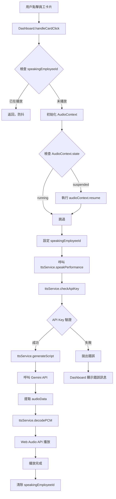

# TTS 語音播報功能 - Agent 技能手冊


## 功能概述

為員工績效卡片整合 Gemini 2.5 TTS 功能，讓主管透過點擊聆聽 AI 彙報員工績效。

## 呼叫鏈 (Call Graph)



**關鍵入口點**：
- **用戶觸發**：`components/Dashboard.tsx` → `handleCardClick(emp, event)`
- **TTS 核心**：`services/ttsService.ts` → `speakPerformance(emp, audioContext)`
- **API Key 檢查**：`services/ttsService.ts` → `checkApiKey()`
- **音訊解碼**：`services/ttsService.ts` → `decodePCM(base64Audio, audioContext)`

## Quick Runbook - 快速診斷流程

當用戶回報「播放失敗」時，按此順序檢查：

### Step 1: 檢查環境變數

#### Windows PowerShell
```powershell
Test-Path .env.local
Get-Content .env.local
# 應顯示: VITE_GEMINI_API_KEY=AIza...
```

#### macOS/Linux (Bash)
```bash
test -f .env.local && cat .env.local
# 應顯示: VITE_GEMINI_API_KEY=AIza...
```

**常見錯誤**：
- ❌ 檔案不存在 → 建立 `.env.local`
- ❌ 變數名稱錯誤（缺少 `VITE_` 前綴）→ 重命名為 `VITE_GEMINI_API_KEY`
- ❌ 使用佔位符 `__GEMINI_API_KEY__` → 替換為真實金鑰

### Step 2: 確認開發伺服器已重啟
```bash
# Vite 必須重啟才能載入新的環境變數
# 按 Ctrl+C 停止，然後：
npm run dev
```

### Step 3: 檢查瀏覽器 Console
打開 F12 → Console 分頁，查看：
1. **TTS Response:** 日誌（在 `speakPerformance` 函數中）
2. 是否有 404/403/429 錯誤
3. AudioContext 狀態

### Step 4: 驗證 API Key
```javascript
// 在 Console 執行
console.log(import.meta.env.VITE_GEMINI_API_KEY);
// 應顯示完整金鑰，不是 undefined
```

### Step 5: 測試 AudioContext
```javascript
// 在 Console 執行
const ctx = new AudioContext();
console.log(ctx.state); // 應為 "running" 或 "suspended"
ctx.resume().then(() => console.log('AudioContext 已啟動'));
```

### Step 6: 檢查網路請求
打開 F12 → Network 分頁：
1. 點擊員工卡片觸發播放
2. 查看呼叫 `...:generateContent` 的請求（或任何打到 `generativelanguage.googleapis.com` 的請求）
3. 確認 Status Code（應為 200）
4. 檢查 Response 是否包含 `inlineData`

## Vite 環境變數載入規則 ⚠️ 重要

### 1. 變數命名規則
```env
# ✅ 正確：必須以 VITE_ 開頭
VITE_GEMINI_API_KEY=AIzaSy...

# ❌ 錯誤：缺少前綴，Vite 不會載入
GEMINI_API_KEY=AIzaSy...
API_KEY=AIzaSy...
```

### 2. 讀取方式
```typescript
// ✅ 正確：使用 import.meta.env
const apiKey = (import.meta as any).env?.VITE_GEMINI_API_KEY;

// ❌ 錯誤：Vite 不支援 process.env
const apiKey = process.env.VITE_GEMINI_API_KEY; // undefined
```

**關鍵讀取點**（Agent 修改時請勿更改）：
- `services/ttsService.ts` → `getApiKey()` 函數內
- `services/geminiService.ts` → `getApiKey()` 函數內

### 3. 修改後必須重啟
```bash
# 修改 .env.local 後必須執行
Ctrl + C  # 停止開發伺服器
npm run dev  # 重新啟動
```

**不重啟的後果**：
- `import.meta.env.VITE_GEMINI_API_KEY` 仍為舊值或 `undefined`
- API 呼叫失敗（401 或 "API Key 未設定"）

### 4. 檔案位置
```
專案根目錄/
├── .env.local          ← 環境變數檔案（應在此）
├── components/
├── services/
└── ...
```

**❌ 錯誤位置**：
- `components/.env.local`
- `services/.env.local`
- 任何子目錄中

## 技術架構

### 服務模組
- **檔案**: `services/ttsService.ts`
- **模型**: `gemini-2.5-flash-preview-tts`
- **音色**: `Aoede`（中文女聲，適合專業播報）
- **音訊格式**: PCM 16-bit, 24kHz 單聲道

### 播報腳本結構
```typescript
const script = `
  ${emp.name}，今日關鍵指標為：
  派單數 ${emp.todayLeads} 單，成交率 ${emp.todayConvRate}，客單價 ${emp.avgOrderValue.toLocaleString()} 元。
  目前歸類為「${emp.category}」，業績排名第 ${emp.revenueRank} 名。
  AI 建議：${emp.aiAdvice}
`.trim();
```

## 使用方式

### 1. 環境設定

在專案根目錄建立 `.env.local`：
```env
VITE_GEMINI_API_KEY=你的真實API金鑰
```

**重要檢查項目**：
- ✅ API Key 不可為空
- ✅ 不可使用佔位符（`__GEMINI_API_KEY__`, `placeholder`）
- ✅ 必須是有效的 Gemini API Key

### 2. 前端整合

在 `Dashboard.tsx` 中點擊任一員工卡片即可觸發播放。

**狀態管理**：
```typescript
const [speakingEmployeeId, setSpeakingEmployeeId] = useState<string | null>(null);
const audioContextRef = useRef<AudioContext | null>(null);
```

**播放流程**：
```typescript
const handleCardClick = async (emp: EmployeeData, event: React.MouseEvent) => {
  // 1. 防抖檢查
  if (speakingEmployeeId) return;
  
  // 2. 初始化 AudioContext
  if (!audioContextRef.current) {
    audioContextRef.current = new AudioContext();
  }
  
  // 3. 解除瀏覽器自動播放封鎖
  if (audioContextRef.current.state === 'suspended') {
    await audioContextRef.current.resume();
  }
  
  // 4. 設定播放狀態
  setSpeakingEmployeeId(emp.id);
  
  // 5. 播放語音
  await speakPerformance(emp, audioContextRef.current);
  
  // 6. 播放完成，清除狀態
  setSpeakingEmployeeId(null);
};
```

### 3. 視覺反饋

**播放中的卡片**：
- 藍色呼吸燈外框：`ring-4 ring-blue-400`
- 音波圖示：`🔊` + `animate-bounce` 動畫
- 位置：卡片右上角

## 常見錯誤與解決方案

### 錯誤 1: API Key 未設定
**症狀**：
```
⚠️ Gemini API Key 未設定！
```

**解決方案**：
1. 檢查 `.env.local` 是否存在
2. 確認檔案內容為：`VITE_GEMINI_API_KEY=你的金鑰`
3. 重啟開發伺服器（`npm run dev`）

---

### 錯誤 2: 預設 API Key
**症狀**：
```
❌ 偵測到預設 API Key！
```

**解決方案**：
將 `.env.local` 中的 `__GEMINI_API_KEY__` 替換為真實金鑰。

---

### 錯誤 3: 配額已達上限 (429)
**症狀**：
```
⏱️ API 配額已達上限
點擊太頻繁，請稍候 30 秒後再試。
```

**解決方案**：
- 等待 30-60 秒後再試
- 至 [Google AI Studio](https://aistudio.google.com/) 檢查配額狀態
- 考慮升級為付費方案

---

### 錯誤 4: 模型權限不足 (403)
**症狀**：
```
🔒 模型權限不足
您的 API Key 所屬專案尚未獲得 TTS 模型使用權限。
```

**解決方案**：
1. 前往 [Google AI Studio](https://aistudio.google.com/)
2. 確認專案已啟用 `gemini-2.5-flash-preview-tts` 模型
3. 若無權限，請申請或建立新專案

---

### 錯誤 5: API Key 無效 (401)
**症狀**：
```
🔑 API Key 無效
```

**解決方案**：
1. 檢查 `.env.local` 中的金鑰是否完整無誤
2. 確認金鑰沒有過期
3. 至 [Google AI Studio](https://aistudio.google.com/apikey) 重新生成金鑰

---

### 錯誤 6: 網路連線失敗
**症狀**：
```
📡 網路連線失敗
```

**解決方案**：
1. 檢查網路連線
2. 確認防火牆未封鎖 `generativelanguage.googleapis.com`
3. 嘗試使用 VPN（若在中國大陸）

---

### 錯誤 7: 模型不可用 (404)
**症狀**：
```
🤖 模型不可用
gemini-2.5-flash-preview-tts 模型可能暫時無法使用
```

**解決方案**：
1. 確認模型名稱正確（**不是** `gemini-2.0-flash-exp`）
2. 檢查 `services/ttsService.ts` → `speakPerformance` 函數內的 model 參數
3. 若仍失敗，可能是 Google 服務暫時中斷，請稍後再試

---

### 錯誤 8: 瀏覽器自動播放封鎖
**症狀**：AudioContext 處於 suspended 狀態，無聲音

**解決方案**：
已在程式碼中自動處理（`audioContext.resume()`）。若仍無效：
1. 檢查瀏覽器設定 → 音訊權限
2. 手動允許網站播放音訊

## 音訊解碼細節

### PCM 解碼流程
```typescript
const decodePCM = async (base64Audio: string, audioContext: AudioContext) => {
  // 1. 移除 base64 前綴
  const base64Data = base64Audio.includes(',') ? base64Audio.split(',')[1] : base64Audio;
  
  // 2. 解碼 base64 為二進位
  const binaryString = atob(base64Data);
  const bytes = new Uint8Array(binaryString.length);
  for (let i = 0; i < binaryString.length; i++) {
    bytes[i] = binaryString.charCodeAt(i);
  }
  
  // 3. 轉換為 Int16 PCM 樣本
  // ⚠️ 注意：若 bytes 是 slice 產生的，需指定 offset/length 避免錯位
  // 更穩妥的寫法：new Int16Array(bytes.buffer, bytes.byteOffset, Math.floor(bytes.byteLength / 2))
  const int16Array = new Int16Array(bytes.buffer);
  
  // 4. 創建 AudioBuffer (單聲道, 24kHz)
  const audioBuffer = audioContext.createBuffer(1, int16Array.length, 24000);
  const channelData = audioBuffer.getChannelData(0);
  
  // 5. Int16 轉 Float32 (-1.0 到 1.0)
  for (let i = 0; i < int16Array.length; i++) {
    channelData[i] = int16Array[i] / 32768.0;
  }
  
  return audioBuffer;
};
```

## 可用音色列表

支援的音色（`voiceName`）：
- **Aoede**：中文女聲，專業、清晰（當前使用）
- **Charon**：中文男聲，穩重
- **Puck**：中文女聲，活潑
- **Kore**：英文女聲
- **Fenrir**：英文男聲

## 效能優化建議

1. **防抖機制**：已實作，播放中點擊無效
2. **AudioContext 重用**：使用 `useRef` 避免重複創建
3. **錯誤捕獲**：所有錯誤皆有中文提示
4. **音訊預載**：未實作（可考慮加入快取機制）

## 開發除錯

### 啟用 Console 日誌
在 `services/ttsService.ts` → `speakPerformance` 函數中：
```typescript
console.log('TTS Response:', response);
```

### 檢查回應結構
```typescript
console.log('Audio Part:', audioPart);
console.log('Audio Data Length:', audioData.length);
```

## 參考資源

- [Gemini API 文件](https://ai.google.dev/gemini-api/docs/)
- [Google AI Studio](https://aistudio.google.com/)
- [取得 API Key](https://aistudio.google.com/apikey)
