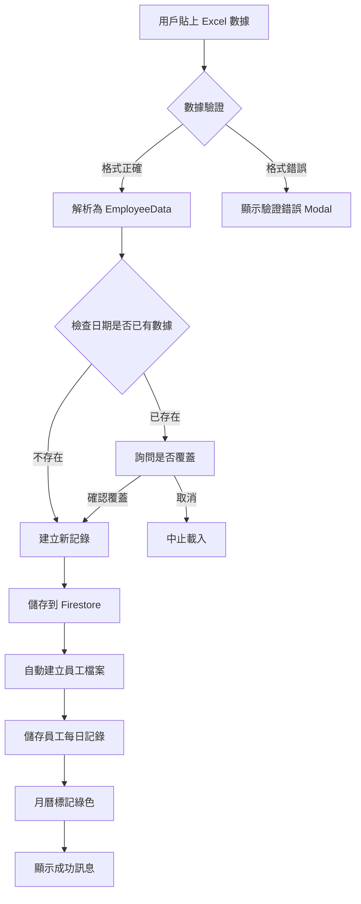
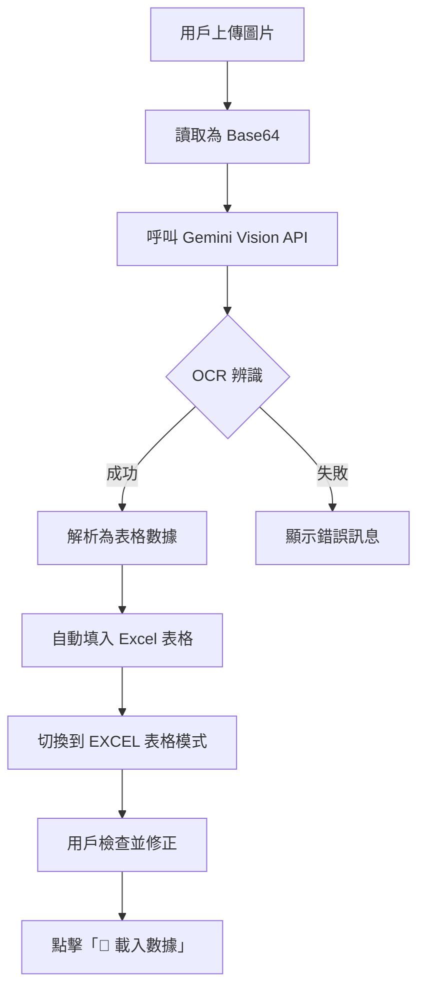
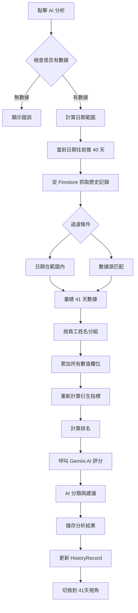
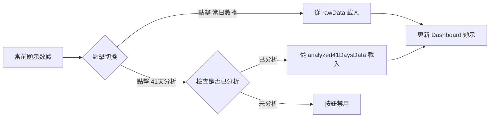
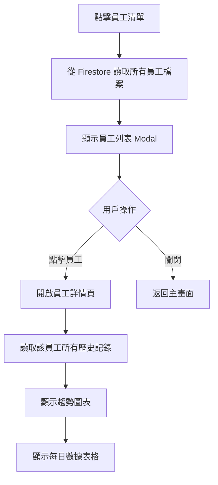
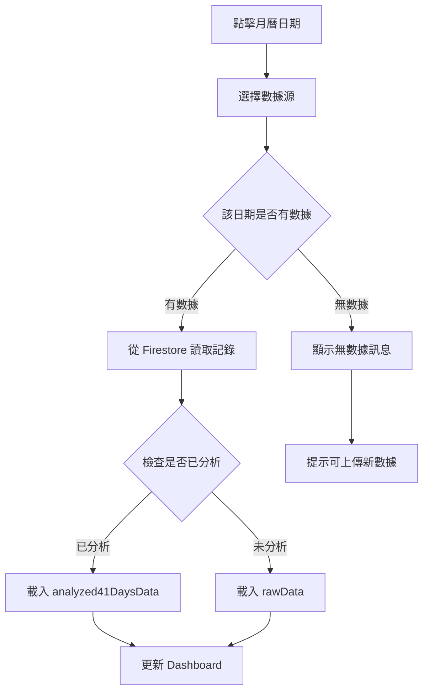
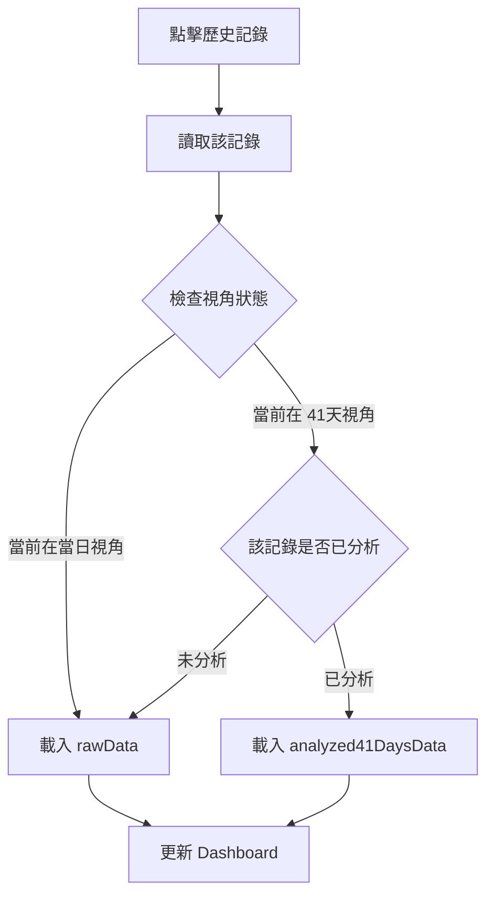
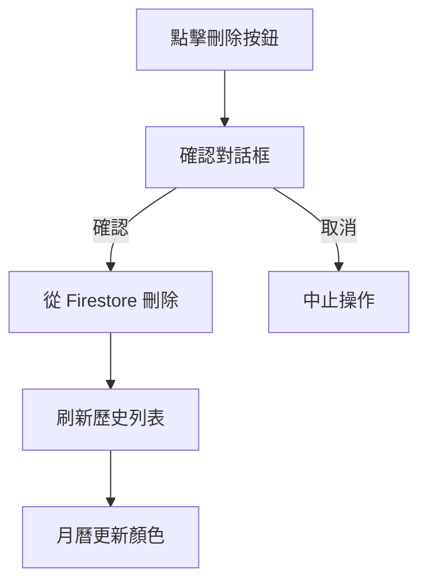
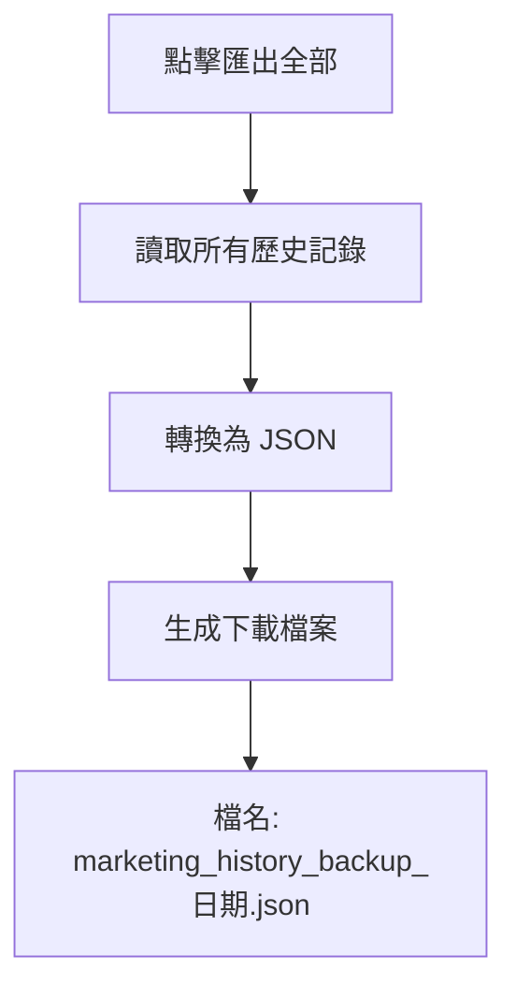
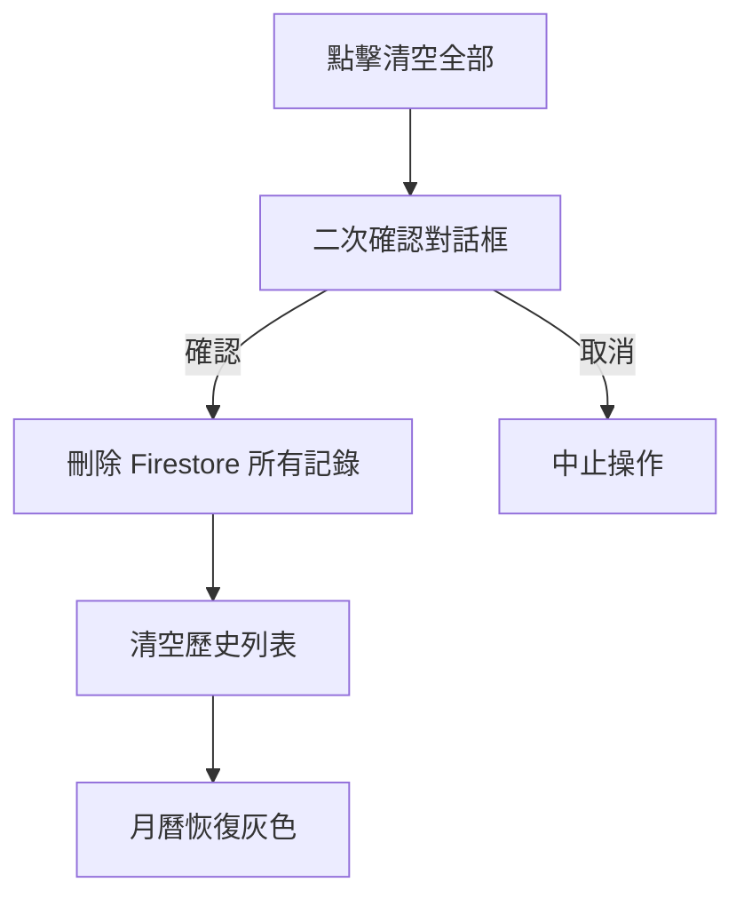

# 行銷火力分析系統 - 完整操作手冊
# Marketing Firepower Analysis System - Complete User Guide

## 📋 專案簡介

行銷火力分析系統是一個基於 React + Vite + TypeScript 開發的數據分析平台，整合 Google Gemini AI 和 Firebase Firestore，提供雙視角數據分析（當日數據 vs 41天累積分析）。

**核心技術棧**:
- React 19 + Vite 6 + TypeScript
- Google Gemini AI (AI 分析與 OCR)
- Firebase Firestore (數據儲存)
- Recharts (數據視覺化)

---

## � 快速開始

### 首次安裝
```bash
cd Firepower_Analysis
npm install
npm run dev
```

### 環境變數設置

在根目錄建立 `.env.local` 文件：

```env
VITE_GEMINI_API_KEY=你的_Gemini_API_金鑰
VITE_FIREBASE_API_KEY=你的_Firebase_API_金鑰
VITE_FIREBASE_AUTH_DOMAIN=你的專案.firebaseapp.com
VITE_FIREBASE_PROJECT_ID=你的專案ID
VITE_FIREBASE_STORAGE_BUCKET=你的專案.firebasestorage.app
VITE_FIREBASE_MESSAGING_SENDER_ID=你的發送者ID
VITE_FIREBASE_APP_ID=你的應用ID
```

**取得 API 金鑰**:
- Gemini: [Google AI Studio](https://aistudio.google.com/app/apikey)
- Firebase: [Firebase Console](https://console.firebase.google.com/) > 專案設定 > 一般

---

## 🔄 核心操作流程圖

### 1️⃣ 按鈕：📂 載入數據（EXCEL 表格模式）

**用戶操作**: 在 Excel 表格中貼上數據 → 點擊「📂 載入數據」



**數據結構**:
```typescript
// 輸入: Excel 11 欄位
行銷 | 派單數 | 派成數 | 追續數 | 總業績 | 派單價值 | 追續總額 | 業績排名 | 追續排名 | 均價排名 | 派單成交率

// 解析為 EmployeeData 物件
{
  name: "員工姓名",
  todayLeads: 派單數,
  todaySales: 派成數,
  followupCount: 追續數,
  todayNetRevenue: 總業績,
  avgOrderValue: 派單價值,
  todayFollowupSales: 追續總額,
  revenueRank: "業績排名",
  followupRank: "追續排名",
  avgPriceRank: "均價排名",
  todayConvRate: "派單成交率"
}
```

**儲存邏輯**:
1. **HistoryRecord** (歷史記錄表)
   - `rawData`: 儲存當日原始數據
   - `analyzed41DaysData`: 初始為 `undefined`（尚未分析）
   - `isAnalyzed`: `false`
   - `archiveDate`: 選擇的日期 (YYYY-MM-DD)
   - `dataSource`: 'minshi' | 'yishin' | 'combined'

2. **EmployeeProfile** (員工檔案表)
   - 首次出現的員工自動建檔
   - 已存在的員工更新 `updatedAt`

3. **EmployeeDailyRecord** (員工每日記錄表)
   - 每個員工每天一筆記錄
   - `rawData`: 當日原始數據
   - `analyzed41DaysData`: 初始為 `undefined`

---

### 2️⃣ 按鈕：� AI 報表辨識

**用戶操作**: 切換到「AI 報表辨識」→ 上傳截圖



**技術細節**:
- 使用 `geminiService.extractDataFromImage()`
- Gemini 模型: `gemini-2.0-flash-exp`
- 返回二維陣列 `string[][]`
- 自動填入表格供用戶檢查

---

### 3️⃣ 按鈕：🧠 AI 分析

**用戶操作**: 載入數據後 → 點擊「🧠 AI 分析」



**數據彙總邏輯**:
```typescript
// 1. 抓取歷史數據
const startDate = 當前日期 - 40天
const endDate = 當前日期
const records = Firestore.where('archiveDate', '>=', startDate)
                        .where('archiveDate', '<=', endDate)
                        .where('dataSource', '==', currentDataSource)

// 2. 按員工分組累加
employeeMap.forEach(員工 => {
  累加: todayLeads, todaySales, todayNetRevenue, 
       followupCount, todayFollowupSales, ...等所有數值欄位
})

// 3. 重新計算
成交率 = (派成數 / 派單數) * 100
派單價值 = 總業績 / 派單數

// 4. 計算排名
業績排名: 按 todayNetRevenue 降序
追續排名: 按 todayFollowupSales 降序
均價排名: 按 avgOrderValue 降序
```

**AI 分析**:
- 模型: `gemini-2.0-flash-exp`
- 輸入: 41天累積數據
- 輸出: 
  - `category`: 潛力之星 🌟 / 穩定型 ⚖️ / 待加強 📈
  - `aiAdvice`: 個人化建議
  - `scoutAdvice`: 星探區建議

**儲存更新**:
```typescript
HistoryRecord {
  rawData: 保持不變（當日原始數據）,
  analyzed41DaysData: AI 分析結果（41天累積）,
  isAnalyzed: true,
  analyzedAt: 當前時間戳
}

EmployeeDailyRecord {
  rawData: 保持不變,
  analyzed41DaysData: 該員工的 41天分析結果
}
```

---

### 4️⃣ 按鈕：📅 當日數據 / 📈 41天分析（視角切換）

**用戶操作**: 點擊視角切換按鈕



**數據來源**:
- **📅 當日數據**: `record.rawData` - 單日原始上傳的數據
- **📈 41天分析**: `record.analyzed41DaysData` - AI 分析後的累積數據

**差異對比**:
| 項目 | 當日數據 | 41天分析 |
|------|---------|---------|
| 派單數 | 單日派單 | 41天累積派單 |
| 總業績 | 單日業績 | 41天累積業績 |
| 成交率 | 單日計算 | 41天重新計算 |
| AI 建議 | 無 | 有（基於長期表現） |
| 分類 | 無 | 有（潛力之星/穩定型/待加強） |

---

### 5️⃣ 按鈕：👥 員工清單

**用戶操作**: 點擊「👥 員工清單」



**員工詳情頁內容**:
1. **基本資訊**: 姓名、狀態、加入日期
2. **歷史記錄**: 所有日期的表現數據
3. **趨勢圖表**: 
   - 業績趨勢線圖
   - 派單數趨勢
   - 成交率趨勢
4. **數據表格**: 可查看每日原始數據或分析數據

---

### 6️⃣ 月曆選擇日期

**用戶操作**: 點擊月曆上的日期



**月曆顏色標記**:
- **綠色**: 該日期有數據
- **灰色**: 該日期無數據
- **藍色邊框**: 當前選擇的日期

**查詢邏輯**:
```typescript
getRecordByDateDB(date, dataSource)
// 查詢條件:
// - archiveDate == 選擇的日期
// - dataSource == 選擇的數據源 (minshi/yishin/combined)
```

---

### 7️⃣ 側邊欄：歷史記錄操作

#### 📂 載入歷史記錄



#### 🗑️ 刪除記錄



#### 📦 匯出全部



#### 🧹 清空全部



---

## � 數據儲存架構

### Firestore Collections

```
firestore/
├── history_records/              # 歷史記錄
│   └── {recordId}
│       ├── id: string
│       ├── title: string
│       ├── archiveDate: string   # YYYY-MM-DD
│       ├── dataSource: string    # minshi/yishin/combined
│       ├── rawData: EmployeeData[]
│       ├── analyzed41DaysData: EmployeeData[]
│       ├── isAnalyzed: boolean
│       └── analyzedAt: string
│
├── employee_profiles/            # 員工檔案
│   └── {employeeId}
│       ├── id: string
│       ├── name: string
│       ├── status: string        # active/inactive
│       ├── accountStatus: string # enabled/disabled
│       ├── joinDate: string
│       └── notes: string
│
└── employee_daily_records/       # 員工每日記錄
    └── {employeeId-date-source}
        ├── employeeId: string
        ├── date: string
        ├── rawData: EmployeeData
        ├── analyzed41DaysData: EmployeeData
        └── source: string
```

---

## ❓ 常見問題

### Q1: AI 分析沒反應？
**檢查項目**:
1. `.env.local` 是否存在且包含 `VITE_GEMINI_API_KEY`
2. 瀏覽器 Console (F12) 是否有錯誤
3. Gemini API 配額是否超限
4. 網路連線是否正常

### Q2: 載入數據後看不到？
**可能原因**:
1. Excel 格式不正確（需 11 欄位）
2. 日期格式錯誤（需 YYYY-MM-DD）
3. 數據源選擇錯誤
4. 查看 Console 錯誤訊息

### Q3: 41天分析按鈕禁用？
**原因**: 尚未執行 AI 分析
**解決**: 點擊「🧠 AI 分析」按鈕

### Q4: 月曆沒有綠色標記？
**原因**: 該日期沒有對應數據源的記錄
**解決**: 選擇正確的數據源或上傳新數據

### Q5: .env.local 檔案不見了？
**原因**: 該檔案在 `.gitignore` 中，不會被 Git 追蹤
**解決**: 參考上方「環境變數設置」重新建立

---

## 🎯 完整使用範例

### 情境：分析 2026-02-14 的民視表數據

**步驟 1: 載入數據**
1. 月曆選擇：2026-02-14
2. 數據源選擇：民視表
3. 從 Excel 複製數據 → 貼到表格
4. 點擊「📂 載入數據」
5. ✅ 系統儲存 20 名員工的當日數據
6. 月曆 2026-02-14 變綠色

**步驟 2: 執行 AI 分析**
1. 點擊「🧠 AI 分析」
2. 系統自動抓取 2026-01-05 ~ 2026-02-14 的民視表數據
3. 假設找到 15 筆歷史記錄
4. 彙總 41 天數據（累加派單數、業績等）
5. AI 評分與分類
6. ✅ 分析完成，自動切換到「📈 41天分析」視角

**步驟 3: 查看結果**
- 查看員工分類（潛力之星 🌟、穩定型 ⚖️、待加強 📈）
- 查看 AI 個人化建議
- 查看排名（業績、追續、均價）

**步驟 4: 對比分析**
- 點擊「📅 當日數據」→ 查看 2026-02-14 單日表現
- 點擊「� 41天分析」→ 查看 41 天累積表現
- 對比短期 vs 長期差異

**步驟 5: 員工詳情**
- 點擊「👥 員工清單」
- 選擇特定員工
- 查看歷史趨勢圖和每日數據

---

## 📄 授權

MIT License

**最後更新**: 2026-02-14
